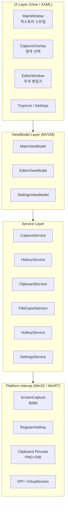
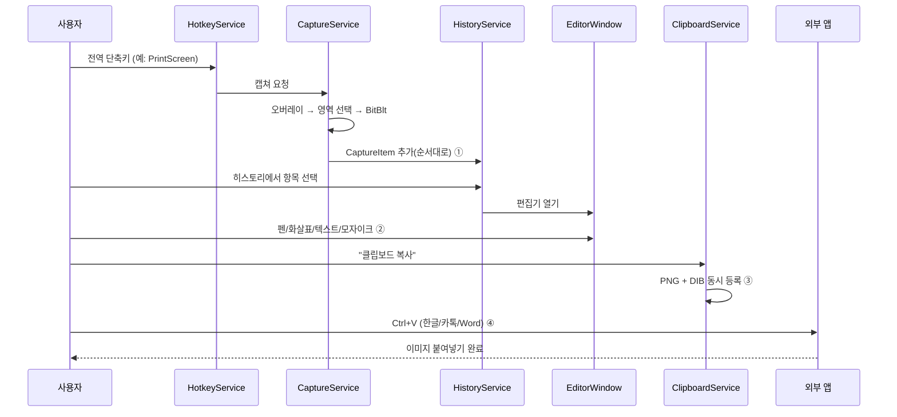

# SnapStack 개발계획서

> 알캡쳐(ALCapture) 류의 Windows 화면 캡쳐 도구 — **캡쳐 → 순서대로 누적 → 페인팅 → 클립보드 복사 → 타 프로그램 붙여넣기**까지의 흐름을 매끄럽게 잇는 개인용/포트폴리오 데스크톱 앱.

| 항목 | 내용 |
|------|------|
| 프로젝트명 | **SnapStack** |
| 플랫폼 | Windows 10 / 11 (x64) 전용 |
| 기술 스택 | C# 12, **.NET 8 (LTS)**, WPF, MVVM |
| 용도 | 개인 사용 · 학습 · 포트폴리오 |
| 라이선스 | MIT |
| 문서 버전 | v0.1 (2026-06-15 작성) |
| 상태 | 🚧 계획 단계 (개발 착수 전) |

---

## 1. 프로젝트 개요

### 1.1 배경
이스트소프트의 **알캡쳐**는 한국에서 사실상 표준처럼 쓰이는 무료 화면 캡쳐 도구다. 핵심 사용 흐름은 단순하다 — *화면을 잘라내고 → 그 위에 표시(화살표·강조·모자이크)를 하고 → 클립보드에 담아 메신저·문서에 붙여넣는다*. SnapStack은 이 흐름을 C# WPF로 직접 구현하면서, 알캡쳐가 약한 **"캡쳐 결과를 순서대로 쌓아 다시 꺼내 쓰는"** 워크플로를 1급 기능으로 끌어올린 학습/포트폴리오 프로젝트다.

### 1.2 한 줄 정의
> "찍고(Snap) → 쌓고(Stack) → 그리고 → 붙여넣는다." Windows용 경량 캡쳐·주석·클립보드 도구.

### 1.3 핵심 가치 (반드시 포함하는 4대 기능)
사용자가 명시한 필수 요건이며, 본 프로젝트의 차별점이자 검수 기준이다.

| # | 필수 기능 | 설명 | 관련 마일스톤 |
|---|-----------|------|---------------|
| 1 | **캡쳐 히스토리(순서대로 표시)** | 캡쳐한 이미지들을 캡쳐한 순서대로 썸네일 스트립에 누적해 보여주고, 언제든 다시 선택 | M2 |
| 2 | **페인팅/주석 편집** | 선택한 캡쳐 이미지 위에 펜·도형·화살표·텍스트·형광펜·모자이크 등으로 그리기 | M3 |
| 3 | **클립보드로 복사** | 편집한 이미지를 클립보드에 이미지로 저장 | M4 |
| 4 | **타 프로그램 붙여넣기** | 메신저·문서·이미지 편집기 등 외부 앱에 Ctrl+V로 곧바로 붙여넣기 | M4 |

---

## 2. 목표와 범위

### 2.1 In Scope (v1.0 목표)
- 영역 지정 캡쳐 / 활성 창 캡쳐 / 전체 화면 캡쳐 / 직전 영역 재캡쳐
- 다중 모니터 지원, Per-Monitor DPI 대응
- 캡쳐 히스토리(순서 누적 · 재선택 · 삭제)
- 이미지 주석 편집기(펜·형광펜·도형·화살표·텍스트·번호·모자이크/블러·자르기 · Undo/Redo)
- 클립보드 복사(다중 포맷 호환) 및 외부 앱 붙여넣기
- 파일 저장/내보내기 (PNG · JPG · BMP)
- 전역 단축키 · 시스템 트레이 상주 · 설정 화면

### 2.2 Out of Scope (v1 제외 · 향후 검토)
- 스크롤(긴 페이지) 캡쳐, 화면 녹화(GIF/동영상)
- OCR(글자 인식), QR/바코드 인식
- 클라우드 업로드·공유 링크
- 자동 업데이트, 코드 서명, 다국어(개인/포트폴리오 범위이므로 후순위)
- macOS / Linux (Windows 전용 확정)

### 2.3 성공 기준 (Definition of Done · 제품 레벨)
- [ ] 단축키 한 번으로 영역 캡쳐 → 히스토리에 순서대로 적재된다
- [ ] 히스토리에서 이미지를 골라 편집기에서 화살표·텍스트·모자이크를 입힐 수 있다
- [ ] 편집 결과를 클립보드에 복사해 **한글/메모장/카카오톡/Word 등 외부 앱에 붙여넣기**가 된다
- [ ] 다중 모니터 + 서로 다른 배율(100%/150%)에서 캡쳐 좌표가 정확하다
- [ ] 앱 재시작 후에도 직전 세션의 캡쳐 히스토리가 복원된다(선택 구현)

---

## 3. 핵심 기능 요약

```
[캡쳐 트리거]                [히스토리]            [편집기]              [출력]
 전역 단축키 ─┐                                    펜/형광펜
 트레이 메뉴 ─┼─▶ 캡쳐 엔진 ─▶ 순서대로 누적 ─▶ 도형/화살표/텍스트 ─▶ 클립보드 복사 ─▶ 외부앱 붙여넣기
 메인 UI ────┘    (영역/창/전체)   (썸네일 스트립)   모자이크/자르기        파일 저장(PNG/JPG)
                                      ▲                    │
                                      └──── 재선택/재편집 ──┘
```

| 분류 | 기능 | 비고 |
|------|------|------|
| 캡쳐 | 영역 지정 | 드래그로 사각 영역 선택, 실시간 치수 표시 |
| 캡쳐 | 활성 창 / 단위 영역 | 마우스 아래 창·컨트롤 자동 하이라이트 |
| 캡쳐 | 전체 화면 | 현재 모니터 / 전체 가상 화면 |
| 캡쳐 | 직전 영역 재캡쳐 | 마지막 영역 좌표 기억 |
| 캡쳐 | 지연 캡쳐 | N초 후 캡쳐(메뉴·툴팁 캡쳐용) |
| **히스토리** | **순서대로 누적** | **ObservableCollection, 썸네일 스트립** |
| 히스토리 | 재선택/재편집/삭제/전체 비우기 | |
| **편집** | **펜·형광펜·도형·화살표·직선** | |
| **편집** | **텍스트·번호 스탬프·모자이크/블러·자르기** | |
| 편집 | Undo/Redo, 색상/굵기 | |
| **출력** | **클립보드 복사(다중 포맷)** | PNG + DIB 동시 등록으로 호환성 확보 |
| **출력** | **외부 앱 붙여넣기** | 클립보드 경유 Ctrl+V |
| 출력 | 파일 저장 | PNG/JPG/BMP, 파일명 규칙·기본 폴더 |
| 시스템 | 전역 단축키, 트레이 상주, 설정 | |

---

## 4. 기술 스택 및 핵심 기술 검토

### 4.1 기반
| 영역 | 선택 | 근거 / 대안 |
|------|------|-------------|
| 언어/런타임 | C# 12 / **.NET 8 LTS** | LTS로 안정성. .NET 9도 가능하나 LTS 우선 |
| UI | **WPF** | 벡터 기반·DPI 대응 우수, InkCanvas 등 그리기 기반 제공. 대안: WinUI3(생태계 미성숙), WinForms(편집기 UI 한계) |
| 아키텍처 | **MVVM** + CommunityToolkit.Mvvm | 테스트 용이·관심사 분리. Source Generator로 보일러플레이트 최소화 |
| DI | Microsoft.Extensions.DependencyInjection | 서비스 수명주기 관리 |
| 트레이 | **H.NotifyIcon.Wpf** | WPF용 트레이 아이콘 표준 라이브러리 |

### 4.2 핵심 난제별 기술 선택

#### (1) 화면 캡쳐 방식
| 방식 | 장점 | 단점 | 채택 |
|------|------|------|------|
| **GDI BitBlt** (`Graphics.CopyFromScreen`) | 단순·빠름·영역 캡쳐에 최적 | 일부 GPU 가속/보호 콘텐츠 불가 | ✅ **MVP 채택** |
| Windows.Graphics.Capture (WinRT) | GPU 화면·게임 캡쳐 가능, 현대적 | WinRT interop 복잡, 영역 잘라내기 별도 처리 | 🔜 고급 단계 검토 |
| DXGI Desktop Duplication | 고성능·연속 캡쳐(녹화)에 적합 | 구현 복잡, 단발 캡쳐엔 과함 | ❌ (녹화 도입 시) |

→ **결론**: MVP는 `CopyFromScreen` 기반. 가상 화면 좌표(`SystemParameters.VirtualScreen*` / Win32 `GetSystemMetrics(SM_XVIRTUALSCREEN…)`)로 다중 모니터를 한 좌표계로 다룬다.

#### (2) 영역 선택 오버레이
- 전체 가상 화면을 덮는 투명·전체화면 WPF 창(`WindowStyle=None`, `AllowsTransparency=True`, `Topmost`)을 띄우고, 그 위에서 드래그로 사각 영역을 그린다.
- 어두운 마스크 + 선택 영역만 밝게, 실시간 치수/확대경(loupe) 표시.

#### (3) 다중 모니터 · Per-Monitor DPI
- `app.manifest`에 **PerMonitorV2** DPI Awareness 선언.
- 물리 픽셀 ↔ WPF DIP 변환을 한 곳(좌표 변환 헬퍼)에 모아 캡쳐 좌표 오차를 차단.
- **최대 리스크 항목** → M1에서 다중 배율(100%/150%/175%) 환경을 우선 검증.

#### (4) 전역 단축키
- Win32 `RegisterHotKey` + `HwndSource.AddHook`로 WPF 메시지 루프에서 `WM_HOTKEY` 수신.
- 충돌(다른 앱이 선점) 시 등록 실패를 감지해 설정에서 재지정 안내.

#### (5) 클립보드 복사 — **붙여넣기 호환성이 핵심**
- 단순 `Clipboard.SetImage(BitmapSource)`만으로는 일부 앱(구형/특정 메신저)에서 투명도·색이 깨지거나 붙여넣기가 안 될 수 있다.
- **대응**: 하나의 클립보드 데이터 객체에 **PNG(투명 보존) + DIB/Bitmap(광범위 호환)** 포맷을 함께 등록한다. 대상 앱이 지원하는 포맷을 골라 받게 하여 한글·Word·카카오톡·그림판 등 호환성을 최대화.
- 이 항목은 필수 기능 #3·#4의 성패를 좌우하므로 **전용 검증 케이스**를 둔다(§11).

#### (6) 편집 캔버스
- 자유곡선(펜/형광펜): **WPF `InkCanvas`** 활용.
- 도형/화살표/텍스트/번호 스탬프: `Canvas` 위 객체(Shape/Adorner)로 관리 → 개별 이동·삭제·Undo 가능.
- 모자이크/블러·자르기: 선택 영역에 `WriteableBitmap` 픽셀 처리.
- Undo/Redo: 편집 동작을 Command 객체 스택으로 관리.

---

## 5. 시스템 아키텍처

### 5.1 레이어 구조



### 5.2 모듈 / 서비스 책임

| 모듈 | 책임 |
|------|------|
| `CaptureService` | 영역/창/전체 캡쳐, 가상 화면 좌표·DPI 변환, 비트맵 산출 |
| `HistoryService` | 캡쳐 결과를 **순서대로** 보관(ObservableCollection), 썸네일 생성, 영속화 |
| `ClipboardService` | 다중 포맷(PNG+DIB) 클립보드 등록/읽기 |
| `FileExportService` | PNG/JPG/BMP 저장, 파일명 규칙·기본 폴더 |
| `HotkeyService` | 전역 단축키 등록/해제·충돌 처리 |
| `SettingsService` | 설정 직렬화(JSON), 단축키·저장경로·포맷 보존 |
| `EditorViewModel` | 편집 도구 상태, 드로잉 객체 컬렉션, Undo/Redo |

### 5.3 핵심 데이터 흐름 (필수 4대 기능)



### 5.4 핵심 데이터 모델 (초안)

```csharp
// 캡쳐 1건 = 히스토리의 한 항목 (순서 보존의 단위)
public sealed class CaptureItem
{
    public Guid Id { get; init; }
    public int Sequence { get; init; }          // 캡쳐 순번(표시 순서 보장)
    public DateTime CapturedAt { get; init; }
    public BitmapSource Original { get; set; }   // 원본 비트맵
    public BitmapSource Thumbnail { get; set; }  // 히스토리용 축소본
    public string? TempFilePath { get; set; }    // 메모리 절약용 임시 저장 경로
    public Size PixelSize { get; init; }
    public bool IsEdited { get; set; }
}
```

---

## 6. 프로젝트 디렉토리 구조 (예정)

```
SnapStack/
├─ src/
│  └─ SnapStack/
│     ├─ SnapStack.csproj
│     ├─ app.manifest            # PerMonitorV2 DPI
│     ├─ App.xaml(.cs)           # DI 컨테이너 구성
│     ├─ Views/                  # MainWindow, CaptureOverlay, EditorWindow, Settings
│     ├─ ViewModels/
│     ├─ Services/               # Capture/History/Clipboard/FileExport/Hotkey/Settings
│     ├─ Interop/                # Win32 PInvoke 래퍼
│     ├─ Models/                 # CaptureItem 등
│     ├─ Editor/                 # 드로잉 도구·Undo 스택
│     └─ Resources/              # 아이콘·스타일
├─ tests/
│  └─ SnapStack.Tests/           # 단위 테스트(서비스·좌표 변환)
├─ docs/
│  ├─ DEVELOPMENT_PLAN.md        # (본 문서)
│  └─ FUNCTIONAL_SPEC.md         # 기능명세서(다음 단계 작성)
├─ .gitignore
├─ LICENSE
└─ README.md
```

---

## 7. 개발 단계 (마일스톤)

| MS | 이름 | 핵심 산출물 | 완료 기준(DoD) |
|----|------|-------------|----------------|
| **M0** | 프로젝트 셋업 | 솔루션·DI·트레이 골격, app.manifest(DPI) | 빈 앱이 트레이에 상주하고 종료된다 |
| **M1** | 캡쳐 코어 | 영역/전체/창 캡쳐, 오버레이, 좌표·DPI 변환 | 다중 모니터·다중 배율에서 정확한 영역이 캡쳐된다 |
| **M2** | **히스토리(순서대로)** | HistoryService, 썸네일 스트립 UI | 연속 캡쳐가 **순서대로** 누적·재선택된다 ★필수1 |
| **M3** | **편집기/페인팅** | 펜·도형·화살표·텍스트·모자이크·Undo | 캡쳐 위에 주석을 그리고 되돌릴 수 있다 ★필수2 |
| **M4** | **클립보드·붙여넣기** | ClipboardService(PNG+DIB), 저장 | 편집본을 복사해 **외부 앱에 붙여넣기**가 된다 ★필수3·4 |
| **M5** | 시스템 통합 | 전역 단축키, 설정 화면, 히스토리 영속화 | 단축키·저장경로·포맷이 설정되고 유지된다 |
| **M6** | 폴리시·배포 | 아이콘·예외처리·성능, 배포 패키지 | 단일 폴더(자체 포함) 실행본이 배포된다 |

> **우선순위 메모**: 사용자가 지정한 필수 4대 기능은 M2~M4에 집중되어 있다. M1(캡쳐 코어)은 그 토대이므로, MVP 검증은 **M1→M2→M3→M4를 한 줄로 관통**시키는 것을 1차 목표로 삼는다.

---

## 8. 일정 (개인 프로젝트 기준 · 시작 2026-06-15)

> 파트타임(주 10~15시간) 가정. 주차는 "집중 작업 주" 기준의 추정치.

| 주차 | 기간(예상) | 마일스톤 | 주요 작업 |
|------|-----------|----------|-----------|
| W1 | 06/16~06/22 | M0 + M1 시작 | 솔루션 셋업, 트레이, DPI 매니페스트, 전체화면 캡쳐 |
| W2 | 06/23~06/29 | M1 | 영역 선택 오버레이, 다중 모니터·DPI 좌표 검증 |
| W3 | 06/30~07/06 | **M2** | 히스토리 누적·썸네일 스트립·재선택 ★ |
| W4 | 07/07~07/13 | **M3-a** | 편집기 셸, 펜/형광펜/도형/화살표 ★ |
| W5 | 07/14~07/20 | **M3-b** | 텍스트·번호·모자이크/블러·자르기·Undo/Redo ★ |
| W6 | 07/21~07/27 | **M4** | 클립보드 다중 포맷·외부 앱 붙여넣기·파일 저장 ★ |
| W7 | 07/28~08/03 | M5 | 전역 단축키·설정 화면·히스토리 영속화 |
| W8 | 08/04~08/10 | M6 | 폴리시·예외처리·성능·배포 패키지·README/스크린샷 |

> ⏱ 총 약 **8주**(파트타임). 일정은 학습 곡선(Win32 interop, DPI)에 따라 ±2주 변동 가능.

---

## 9. 리스크 및 대응

| # | 리스크 | 영향 | 대응 |
|---|--------|------|------|
| R1 | **클립보드 포맷 호환성** — 일부 외부 앱에서 붙여넣기 실패/투명 깨짐 | 높음(필수기능) | PNG+DIB 멀티 포맷 등록, 대표 앱(한글·Word·카톡·그림판) 붙여넣기 매트릭스 검증 |
| R2 | **다중 모니터 + 혼합 DPI 좌표 오차** | 높음 | PerMonitorV2 선언, 좌표 변환 단일화, 100/150/175% 조기 테스트 |
| R3 | 캡쳐 히스토리 **메모리 누적** | 중간 | 썸네일만 메모리, 원본은 임시 폴더에 저장 후 lazy load |
| R4 | 전역 단축키 **충돌**(타 앱 선점) | 중간 | 등록 실패 감지·설정에서 재지정·기본값 회피 |
| R5 | 보호 콘텐츠(DRM)·일부 GPU 화면 캡쳐 불가 | 낮음 | 한계 명시, 필요 시 Windows.Graphics.Capture로 보완 |
| R6 | **.NET SDK 미설치**(현재 환경) | 착수 차단 | §부록대로 SDK 설치 후 착수 |
| R7 | Win32 interop 학습 곡선 | 일정 | M1에 버퍼 주간 확보, 검증된 PInvoke 시그니처 활용 |

---

## 10. 테스트 전략

- **단위 테스트(xUnit)**: 좌표 변환(픽셀↔DIP), 파일명 규칙, 히스토리 순서/삭제 로직, 설정 직렬화.
- **수동 검증 시나리오**:
  - 다중 모니터 × 배율(100/150/175%) 캡쳐 정확도
  - **클립보드 붙여넣기 매트릭스**: 그림판 · 메모장(불가 예상) · 한글 · MS Word · 카카오톡 · Discord
  - 히스토리 연속 캡쳐 순서 보존
- **수동 회귀 체크리스트**: 각 마일스톤 종료 시 필수 4대 기능 관통 테스트.

---

## 11. 배포 / 패키징

- 1차: `dotnet publish -r win-x64 --self-contained` (자체 포함 단일 폴더) → 압축 배포(개인용이라 코드 서명·자동 업데이트 제외).
- 2차(선택): 단일 파일 게시(`PublishSingleFile`), 추후 인스톨러(Inno Setup) 검토.
- 산출물: `SnapStack-win-x64-vX.Y.Z.zip` + README + 스크린샷.

---

## 12. 향후 확장 로드맵 (v1 이후)

1. 스크롤 캡쳐(긴 웹페이지/문서)
2. 화면 녹화(GIF/MP4) — DXGI Desktop Duplication
3. OCR(글자 인식) — Windows.Media.Ocr
4. 핀(Pin) 기능 — 캡쳐를 화면 위에 띄워 고정
5. 클라우드 업로드·공유 링크
6. 자동 업데이트·코드 서명(상용화 전환 시)

---

## 부록 A. 착수 전 전제조건 (환경 셋업)

> 현재 개발 PC에 **.NET SDK가 설치되어 있지 않다.** 개발 착수 전 아래가 필요하다.

1. **.NET 8 SDK 설치**: <https://dotnet.microsoft.com/download/dotnet/8.0> (또는 `winget install Microsoft.DotNet.SDK.8`)
2. **IDE**: Visual Studio 2022(WPF 워크로드) 또는 VS Code + C# Dev Kit
3. 설치 확인: `dotnet --version`, `dotnet --list-sdks`
4. 프로젝트 생성: `dotnet new wpf -n SnapStack -o src/SnapStack`

## 부록 B. 참고 (벤치마크 대상)
- 알캡쳐(ALCapture) — 영역/단위/스크롤 캡쳐 및 주석 편집
- Greenshot, ShareX, Snipping Tool — 오픈소스/기본 도구의 캡쳐·주석·클립보드 처리 방식 참고

---

*본 문서는 계획 단계 산출물이며, 구현 진행에 따라 갱신된다. 상세 기능 정의는 `docs/FUNCTIONAL_SPEC.md`(예정)에서 다룬다.*
